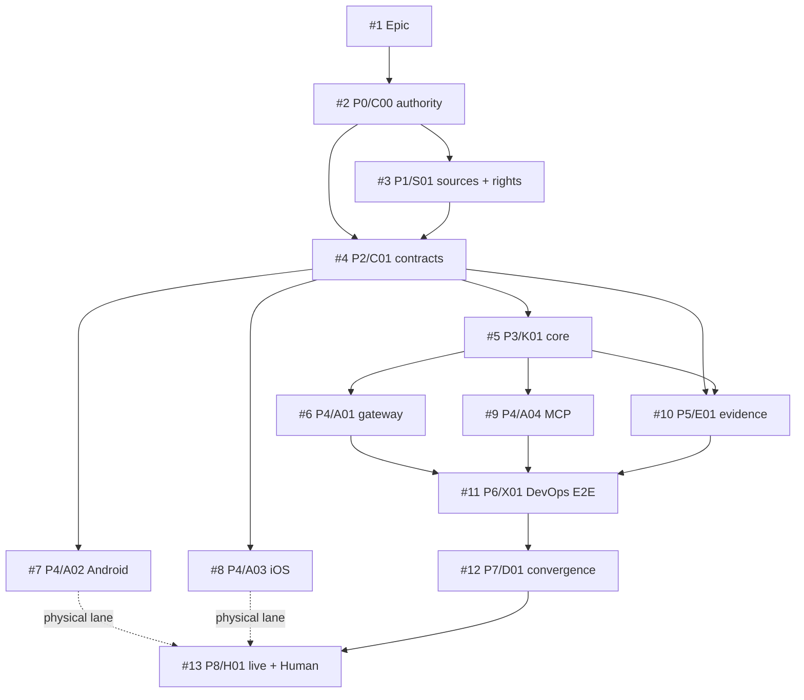
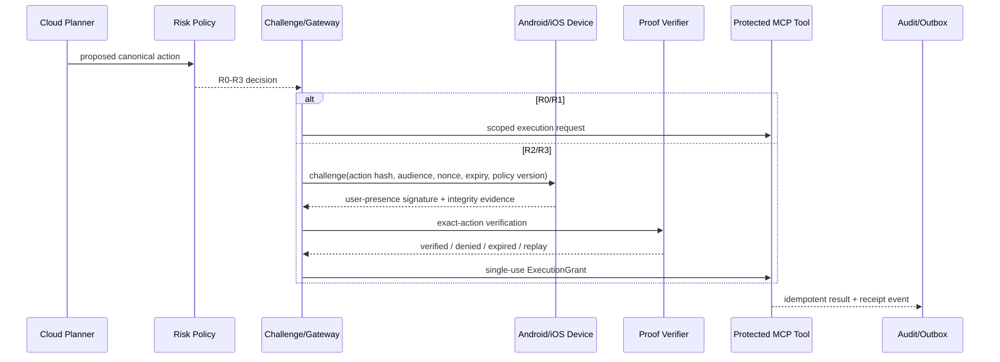

# ActionGate

Hardware-attested authorization for protected autonomous-agent actions.

> An LLM may propose an action. It does not receive unconditional authority to execute it.

## Repository status

| Field | Value |
|---|---|
| Current stage | `P0 AUTHORITY_BOUND`, with P1/D00 Draft packets published |
| Technical implementation | `NOT_IMPLEMENTED` |
| Physical-device evidence | `NOT_EXERCISED` |
| Independent Shadow evidence | `NOT_EXERCISED` |
| Release / production admission | `HUMAN_ADMIT_REQUIRED` |
| License | Apache-2.0 |

Current bootstrap stack:

- [PR #14 — C00 technical control plane](https://github.com/ed3c/ActionGate/pull/14)
- [PR #15 — S01 source, claim, rights and dependency-candidate ledger](https://github.com/ed3c/ActionGate/pull/15), stacked on #14
- [PR #16 — D00 staged prompts and Local Handoff Execution Queue](https://github.com/ed3c/ActionGate/pull/16), stacked on #14 and sibling to #15

All three PRs are Draft. Draft publication is not implementation, verification, merge, release, physical proof, security acceptance, or legal clearance.

## Authority model

ActionGate is the technical system of record for this project only.

| Plane | Authority |
|---|---|
| Public ActionGate repository | Code, technical contracts, schemas, Issues, branches, PRs, checks, receipts, technical architecture and implementation state |
| `ed3c/skills-shared` | Canonical reusable Tech Lead, Shadow Architecture, evidence, Git Town and handoff procedures; referenced rather than vendored |
| Private CodexDoc | Private intent, strategic rationale, private source URLs, business material, non-public roadmap and private context projections |
| Human / organization | Merge, release, production promotion, legal/security acceptance, public/private-boundary changes and irreversible authority |

GitHub exact-subject read-back is authoritative for technical completion. Private CodexDoc is authoritative for private intent. Neither plane may silently overwrite the other.

Public files never contain private Google Drive URLs, customer data, employer-confidential implementation knowledge, business strategy, career material or private roadmap. Authorized Agents resolve private context through the ignored binding contract in `AGENTS.md`.

## Security invariant

An `R3` protected tool must not execute through the compliant path without a fresh, audience-bound, exact-action-bound authorization proof accepted under the current policy version.

The threat model assumes the planner may be compromised. Authorization is enforced at the protected-tool boundary.

## Nine-stage state machine

```text
P0 AUTHORITY_BOUND
  -> P1 SOURCE_ADMITTED
  -> P2 CONTRACTS_BOUND
  -> P3 CORE_IMPLEMENTED
  -> P4 ADAPTERS_IMPLEMENTED
  -> P5 EVIDENCE_VERIFIED
  -> P6 E2E_VERIFIED
  -> P7 CONVERGED_AND_HANDED_OFF
  -> P8 LIVE_OR_HUMAN_ADMITTED
```

Continuous read-only Shadow lane:

```text
READ_ONLY_RECON
-> DELTA_CLASSIFIED
-> PRE_SIDE_EFFECT_GATE
-> ACTION_OBSERVED
-> EVIDENCE_RECONCILED
-> VERIFIED | BLOCKED | FAILED | WAIVED_WITH_AUTHORIZED_REASON
```

A stage is not complete because a file, Issue, branch, PR, dependency, queue contract or green check exists. Exact-subject evidence in the required lane must close the transition.

## Issue and completion DAG



Start-readiness and completion-readiness are separate edge classes. See `docs/traceability/ISSUE_DAG.md`.

## Directory → State Machine → DAG → data flow

| Path | Stage / atom | Writer | Consumes | Produces |
|---|---|---|---|---|
| `contracts/` | `P2 / C01` | contract owner | admitted source constraints | canonical schemas and test vectors |
| `packages/core-domain/` | `P3 / K01` | deterministic-core owner | canonical contracts | risk/challenge/grant/replay decisions |
| `packages/policy/` | `P3 / K01` | policy owner | contracts | versioned risk decisions |
| `packages/gateway/`, `packages/verifier/` | `P4 / A01` | gateway owner | core ports/proofs | verification and authorization service adapter |
| `packages/sdk-android/` | `P4 / A02` | Android owner | challenge/digest | hardware signature and integrity evidence |
| `packages/sdk-ios/` | `P4 / A03` | iOS owner | challenge/digest | hardware signature and integrity evidence |
| `packages/mcp-middleware-python/` | `P4 / A04` | Python MCP owner | tool metadata/grant | protected-tool enforcement |
| `packages/mcp-middleware-typescript/` | `P4 / A04` | TypeScript MCP owner | tool metadata/grant | protected-tool enforcement |
| `packages/testkit/`, `tests/` | `P5 / E01` | evidence owner | candidate atoms | exact-subject receipts and falsifiers |
| `examples/devops-agent/` | `P6 / X01` | E2E owner | admitted C/K/A/E atoms | narrow technical canary receipt |
| `docs/`, `.actiongate/` | `P0/P1/P7 / D` | one convergence owner | GitHub read-back | technical navigation, DAG, Stack and handoff state |

Active writers hold disjoint path/resource leases. Terminal workers do not edit aggregate indexes.

## Runtime data flow



Gateway workers may be horizontally stateless. Device/key registration, policy versions, nonce/grant consumption, idempotency and durable audit state are not stateless.

## Closure loop

```text
Evidence
-> Finding
-> Candidate
-> ChangeUnit
-> Verification
-> ClosureRecord
```

Source statements remain claims until verified. Worker output is candidate evidence. A lower evidence lane cannot satisfy a physical, legal, security or Human gate.

## Molecular Stack PR index

| Atom | Issue | Branch | Draft PR | True base/parent | Lane | State |
|---|---:|---|---:|---|---|---|
| `C00` technical control plane | #2 | `ag/C00-technical-control-plane` | [#14](https://github.com/ed3c/ActionGate/pull/14) | `main` | cloud/static | `DRAFT_PUBLISHED` |
| `S01` source + rights ledger | #3 | `ag/S01-source-rights` | [#15](https://github.com/ed3c/ActionGate/pull/15) | `C00` | cloud/static + primary-repository read-back | `DRAFT_PUBLISHED` |
| `D00` stage prompts + handoff | #2 | `ag/D00-prompts-handoff` | [#16](https://github.com/ed3c/ActionGate/pull/16) | `C00`; sibling to `S01` | cloud/static | `DRAFT_PUBLISHED` |
| `C01` protocol contracts | #4 | `ag/C01-action-contracts` | absent | admitted `C00+S01` | local-deterministic | `BLOCKED` |
| `K01` deterministic core | #5 | `ag/K01-domain-core` | absent | `C01` | local-deterministic | `BLOCKED` |
| `A01-A04` adapters | #6-#9 | sibling branches | absent | `C01/K01` as declared | local/physical | `BLOCKED` |
| `E01` evidence harness | #10 | `ag/E01-evidence-harness` | absent | `C01/K01` | adversarial | `BLOCKED` |
| `X01` DevOps E2E | #11 | `ag/X01-devops-e2e` | absent | admitted C/K/A/E | integration | `BLOCKED` |
| `D01` convergence | #12 | `ag/D01-convergence` | absent | selected release candidate | exact-head read-back | `BLOCKED` |
| `H01` physical/Human lanes | #13 | local/Human lanes | n/a | `D01` | physical/security/legal/Human | `NOT_EXERCISED` |

The detailed index is `docs/traceability/MOLECULAR_STACK_INDEX.md`. Observed PR metadata and exact heads in GitHub remain authoritative; this table is navigation.

## Stage prompt catalogue

PR #16 defines copyable prompts for P0–P8 under `docs/prompts/`, including bounded parallel workers for P4 adapters and P8 independent evidence lanes. Each new session must bind the exact Issue, base/head, path/resource lease, parent receipts, evidence ceiling and Human-owned operations.

## Shared procedures

- Tech Lead: `skills/agentic-tech-lead-orchestration`
- Shadow monitor: `skills/procedural-shadow-runtime` + `skills/spatial-loop-systems-engineering`
- Stacked delivery: `skills/git-town-stacked-pr-worker`
- External mutable claims: `truth-verify-loop` or another admitted primary-source verifier

ActionGate does not copy these Skill bodies. Repository-local bindings constrain their use to this exact subject.

## Local handoff

Repository-only automation cannot close local Git Town/worktree, physical-device, independent security, clean-room/legal or Human-admission lanes. PR #16 compiles the continuation contract in `docs/handoff/LOCAL_HANDOFF_EXECUTION_QUEUE.md` and `.actiongate/local-handoff-queue.json`.

Current queue contract begins with `LH-001` local clean-checkout/read-back. Queue preparation or validation does not prove execution.

## License

Apache License 2.0. Third-party candidates are not admitted merely because they appear in a ledger.