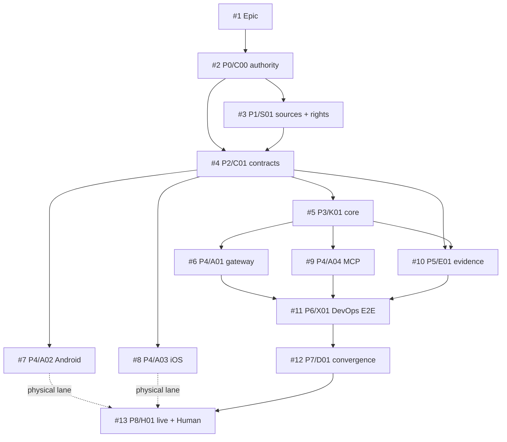
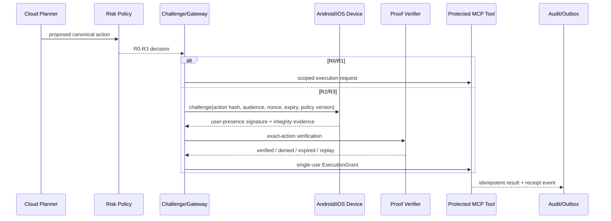

# ActionGate

Hardware-attested authorization for protected autonomous-agent actions.

> An LLM may propose an action. It does not receive unconditional authority to execute it.

## Repository status

| Field | Value |
|---|---|
| Current stage | `P0 AUTHORITY_BOUND` |
| Current branch | `ag/C00-technical-control-plane` |
| Technical implementation | `NOT_IMPLEMENTED` |
| Physical-device evidence | `NOT_EXERCISED` |
| Independent Shadow evidence | `NOT_EXERCISED` |
| Release / production admission | `HUMAN_ADMIT_REQUIRED` |
| Repository license | Apache-2.0 |

This repository currently contains technical architecture, contracts, traceability, prompts, and staged work packets. It does not yet claim a working authorization service, mobile SDK, MCP middleware, security review, customer validation, or production readiness.

## Authority model

ActionGate is the technical system of record for this project only.

| Plane | Authority |
|---|---|
| Public ActionGate repository | Code, technical contracts, schemas, Issues, branches, PRs, checks, receipts, technical architecture, and implementation state |
| `ed3c/skills-shared` | Canonical reusable Tech Lead, Shadow Architecture, evidence, Git Town, and handoff procedures; procedures are referenced, not vendored |
| Private CodexDoc | Private intent, strategic rationale, private source URLs, business material, non-public roadmap, and private context projections |
| Human / organization | Merge, release, production promotion, legal/security acceptance, public/private-boundary changes, and other irreversible authority |

GitHub is authoritative for technical completion. Private CodexDoc is authoritative for private intent. Neither plane may silently overwrite the other.

Public files never contain private Google Drive URLs, customer data, employer-confidential implementation knowledge, business strategy, career material, or private roadmap. Agents resolve private context through the ignored binding contract described in `AGENTS.md`.

## Security invariant

An `R3` protected tool must not execute through the compliant path without a fresh, audience-bound, exact-action-bound authorization proof accepted under the current policy version.

The threat model assumes the planner may be compromised. Authorization is enforced at the protected-tool boundary.

## Nine-stage state machine

```text
P0 AUTHORITY_BOUND
  -> P1 SOURCE_ADMITTED
  -> P2 CONTRACTS_BOUND
  -> P3 CORE_IMPLEMENTED
  -> P4 ADAPTERS_IMPLEMENTED
  -> P5 EVIDENCE_VERIFIED
  -> P6 E2E_VERIFIED
  -> P7 CONVERGED_AND_HANDED_OFF
  -> P8 LIVE_OR_HUMAN_ADMITTED
```

A read-only Shadow Architecture lane observes every material transition:

```text
READ_ONLY_RECON
-> DELTA_CLASSIFIED
-> PRE_SIDE_EFFECT_GATE
-> ACTION_OBSERVED
-> EVIDENCE_RECONCILED
-> VERIFIED | BLOCKED | FAILED | WAIVED_WITH_AUTHORIZED_REASON
```

A stage is not complete because a file, Issue, branch, PR, dependency, or green check exists. Exact-subject evidence in the required lane must close the transition.

## Issue and completion DAG



Start-readiness and completion-readiness are separate edge classes. See `docs/traceability/ISSUE_DAG.md`.

## Directory to state, owner, and data-flow map

| Path | State / atom | Owner | Consumes | Produces |
|---|---|---|---|---|
| `contracts/` | `P2 / C` | Contract owner | admitted source constraints | canonical schemas and test vectors |
| `packages/core-domain/` | `P3 / K` | deterministic-core owner | contracts | risk/challenge/grant/replay decisions |
| `packages/policy/` | `P3 / K` | policy owner | contracts | versioned risk decisions |
| `packages/gateway/` | `P4 / A` | gateway owner | core ports | authorization API and orchestration adapter |
| `packages/verifier/` | `P4 / A` | verifier owner | proof envelopes | verification result |
| `packages/sdk-android/` | `P4 / A` | Android owner | challenge + digest | hardware signature and integrity evidence |
| `packages/sdk-ios/` | `P4 / A` | iOS owner | challenge + digest | hardware signature and integrity evidence |
| `packages/mcp-middleware-python/` | `P4 / A` | Python MCP owner | tool metadata + grant | protected-tool enforcement |
| `packages/mcp-middleware-typescript/` | `P4 / A` | TypeScript MCP owner | tool metadata + grant | protected-tool enforcement |
| `packages/testkit/`, `tests/` | `P5 / E` | evidence owner | all candidate atoms | exact-subject receipts and negative controls |
| `examples/devops-agent/` | `P6 / X` | convergence canary owner | admitted C/K/A/E atoms | end-to-end technical receipt |
| `docs/`, `.actiongate/` | `P0/P1/P7 / D` | one convergence owner | repository read-back | technical navigation, DAG, stack and handoff state |

Active writers must hold disjoint path/resource leases. Terminal workers do not edit aggregate indexes.

## Runtime data flow



Gateway workers may be horizontally stateless. Device/key registration, policy versions, nonce/grant consumption, idempotency, and durable audit state are not stateless.

## Closure loop

```text
Evidence
-> Finding
-> Candidate
-> ChangeUnit
-> Verification
-> ClosureRecord
```

Source statements remain claims until verified. A candidate implementation remains evidence, not correctness. A lower evidence lane cannot satisfy a physical, legal, security, or Human gate.

## Molecular Stack index

| Atom | Issue | Planned branch | PR | Base | Lane | State |
|---|---:|---|---|---|---|---|
| `C00` technical control plane | #2 | `ag/C00-technical-control-plane` | pending | `main` | cloud/static | `IN_PROGRESS` |
| `S01` source + rights ledger | #3 | `ag/S01-source-rights` | pending | `ag/C00-technical-control-plane` | cloud/static | `PLANNED` |
| `D00` stage prompts + handoff | #2 | `ag/D00-prompts-handoff` | pending | `ag/C00-technical-control-plane` | cloud/static | `PLANNED` |
| `C01` protocol contracts | #4 | `ag/C01-action-contracts` | pending | admitted control/source state | local-deterministic | `BLOCKED` |
| `K01` deterministic core | #5 | `ag/K01-domain-core` | pending | `C01` | local-deterministic | `BLOCKED` |
| `A01-A04` adapters | #6-#9 | sibling branches | pending | `C01/K01` as declared | local/physical | `BLOCKED` |
| `E01` evidence harness | #10 | `ag/E01-evidence-harness` | pending | `C01/K01` | adversarial | `BLOCKED` |
| `X01` DevOps E2E | #11 | `ag/X01-devops-e2e` | pending | admitted C/K/A/E | integration | `BLOCKED` |
| `D01` convergence | #12 | `ag/D01-convergence` | pending | selected release candidate | exact-head read-back | `BLOCKED` |
| `H01` physical/Human lanes | #13 | no automatic merge branch | n/a | `D01` | physical/legal/Human | `NOT_EXERCISED` |

The observed PR topology, not this plan, becomes authoritative after publication. See `docs/traceability/MOLECULAR_STACK_INDEX.md`.

## Shared procedures

- Tech Lead: `skills/agentic-tech-lead-orchestration`
- Shadow monitor: `skills/procedural-shadow-runtime` + `skills/spatial-loop-systems-engineering`
- Stacked delivery: `skills/git-town-stacked-pr-worker`
- External mutable claims: `truth-verify-loop` or another admitted primary-source verifier

ActionGate does not copy these Skill bodies. Repository-local bindings constrain their use to this subject.

## Local handoff

Repository-only automation cannot close physical-device, local Git Town/worktree, clean-room/legal, independent security review, or Human-admission lanes. Those items remain typed and executable in `docs/handoff/LOCAL_HANDOFF_EXECUTION_QUEUE.md` and `.actiongate/local-handoff-queue.json`.

## License

Apache License 2.0. Third-party dependencies are not admitted by this repository merely because they appear in a candidate list.