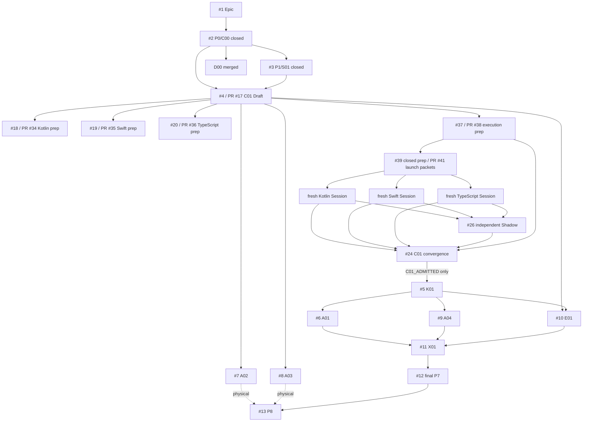

# ActionGate

Hardware-attested authorization for protected autonomous-agent actions.

> An LLM may propose an action. It does not receive unconditional authority to execute it.

## Exact current-state rule

The checked-out Git commit/tree is the technical authority. Run:

```bash
git rev-parse HEAD
git rev-parse HEAD^{tree}
```

Do not infer completion from a PDF, article, private Doc, Issue title, branch name, Draft PR, prompt packet, process exit or model statement.

## Highest earned state

| Plane | State |
|---|---|
| P0/C00 authority and technical routing | `MERGED / CLOSED` at `cloud/static` ceiling |
| P1/S01 source, claim, rights and dependency-candidate admission | `MERGED / CLOSED` at source-disposition ceiling |
| D00 prompts and Local Handoff contract | `MERGED`; queue execution `NOT_EXERCISED` |
| Partial main convergence | #40/PR #42 and #43/PR #44 `MERGED / CLOSED` |
| P2/C01 | contract, execution-control and launch preparation Draft-published; `C01_ADMITTED` not earned |
| Kotlin/Swift/TypeScript Worker Sessions | `NOT_LAUNCHED`; implementation and vectors `NOT_IMPLEMENTED / NOT_EXERCISED` |
| P3–P6 | `NOT_IMPLEMENTED` |
| Physical Android/iOS and independent security | `NOT_EXERCISED` |
| User value / payment | `NOT_EXERCISED` |
| Legal, release and production | `HUMAN_ADMIT_REQUIRED` |
| License | Apache-2.0 |

Stable merged receipts:

| Atom | PR | Merge commit | Evidence ceiling |
|---|---:|---|---|
| C00 | #14 | `fee8c290061542bfb93e27ddcc33cce7fbf8c653` | technical control plane / cloud-static |
| S01 | #15 | `8810fe41f66ad1b4fe80db5f93bf9539e2a38899` | source and rights disposition |
| D00 | #16 | `76efa9297d147712bb9dfbb9e797d69ca9432a99` | prompt and handoff contract |
| D00-MAIN | #42 | `71796b8c4d50fdfbcade85f9bbdf4d3ec988ba99` | exact-main documentation reconciliation |
| D00-DELTA | #44 | `53f1014e4c75a0083c8ebe2972e8f52f3ff33b9d` | PR #41 state reconciliation |

A merged preparation/documentation atom does not prove product, hardware, security, user, paid, legal, release or production truth.

## Authority model

| Plane | Authority |
|---|---|
| ActionGate GitHub | technical contracts, code, Issues, PRs, checks, receipts and exact implementation state |
| `ed3c/skills-shared` | reusable Tech Lead, Shadow, Git Town, evidence and productization procedures; referenced, never copied |
| Private CodexDoc | private intent, business/market context, private source locations and non-public roadmap |
| Human / organization | clean-room declarations, legal/security acceptance, merge, release, production and public/private-boundary changes |

Private locators and private content must not enter this public tree. An authorized Agent may derive a redacted technical delta, then bind it to a public Issue/contract.

## Security invariant

An `R3` protected tool must not execute through the compliant path without a fresh, audience-bound, exact-action-bound authorization proof accepted under the current policy version.

The planner is inside the assumed compromise boundary. Enforcement belongs at the protected-tool boundary.

## State Machine

```text
P0 AUTHORITY_BOUND               MERGED / CLOSED
  -> P1 SOURCE_ADMITTED          MERGED / CLOSED
  -> P2 CONTRACTS_BOUND          OPEN / PREPARATION ONLY
  -> P3 CORE_IMPLEMENTED         NOT_IMPLEMENTED
  -> P4 ADAPTERS_IMPLEMENTED     NOT_IMPLEMENTED
  -> P5 EVIDENCE_VERIFIED        NOT_IMPLEMENTED
  -> P6 E2E_VERIFIED             NOT_IMPLEMENTED
  -> P7 CONVERGED_AND_HANDED_OFF PARTIAL CHECKPOINTS ONLY
  -> P8 LIVE_OR_HUMAN_ADMITTED   NOT_EXERCISED / HUMAN_ADMIT_REQUIRED
```

Continuous Shadow lane:

```text
READ_ONLY_RECON
-> DELTA_CLASSIFIED
-> PRE_SIDE_EFFECT_GATE
-> ACTION_OBSERVED
-> EVIDENCE_RECONCILED
-> VERIFIED | BLOCKED | FAILED | WAIVED_WITH_AUTHORIZED_REASON
```

`SAME_CONTEXT_READ_ONLY_SHADOW` never satisfies an independent-review requirement.

## Current DAG



Start-readiness and completion-readiness are different edge classes. PR #41 is a true child of PR #38 and a routing sibling—not a Git parent—of PR #34/#35/#36.

## Directory ownership and data flow

| Path | Owner | Role | Input → output | Evidence ceiling |
|---|---|---|---|---|
| root `AGENTS.md`, `ARCHITECTURE.md`, `docs/governance/**` | C00/#2 | authority/read route | authority contract → technical-only controls | merged cloud/static |
| `docs/sources/**`, `.actiongate/source-claims.json`, technology candidates | S01/#3 | source/rights | article/PDF/spec/repo → claim classes and candidate rights | merged source disposition |
| `docs/prompts/**`, `docs/handoff/**`, queue | D00/#2 | zero-context routing | stage contracts/unresolved lanes → prompts and handoffs | merged; not executed |
| `contracts/v1/**` | C01/#4 | canonical oracle | C00/S01 constraints → profile/schemas/vectors/ports | Draft preparation |
| `contracts/impl/kotlin/**` | #18 | Kotlin Worker | exact C01 + PR #41 packet → Kotlin candidate/receipt | not implemented |
| `contracts/impl/swift/**` | #19 | Swift Worker | exact C01 + PR #41 packet → Swift candidate/receipt | not implemented |
| `contracts/impl/typescript/**` | #20 | TypeScript Worker | exact C01 + PR #41 packet → TypeScript candidate/receipt | not implemented |
| `.actiongate/c01-execution/**`, `contracts/evidence/**` | #37/PR #38 | execution/schema/receipt preparation | exact C01 blobs → non-transferable prep evidence | Draft preparation |
| `.actiongate/c01-launch/**` | #39/PR #41 | clean-room Session dispatch | PR #38 + Worker heads → zero-placeholder packets | Draft-published; Sessions not launched |
| `packages/core-domain/**`, `packages/policy/**` | K01/#5 | deterministic domain core | admitted C01 → risk/challenge/grant/replay/audit | not implemented |
| `packages/gateway/**`, `packages/verifier/**` | A01/#6 | distributed trust plane | C01/K01 → verification/persistence/idempotency/outbox | not implemented |
| `packages/sdk-android/**` | A02/#7 | Android proof adapter | challenge → Keystore/biometric/integrity evidence | not implemented; physical separate |
| `packages/sdk-ios/**` | A03/#8 | iOS proof adapter | challenge → Secure Enclave/auth/App Attest evidence | not implemented; physical separate |
| `packages/mcp-middleware-*` | A04/#9 | protected-tool boundary | grant semantics → MCP enforcement | not implemented |
| `tests/**`, `packages/testkit/**` | E01/#10 | falsifier plane | candidates → mutation/fault receipts | not implemented |
| `examples/devops-agent/**` | X01/#11 | E2E convergence | admitted C/K/A/E → protected-action receipt | not implemented |
| aggregate README/AGENTS/DAG/Stack | D01/#12 | one convergence owner | exact GitHub readback → current navigation | partial only |
| devices/security/legal/Human | H01/#13 | external evidence | immutable candidate → own-lane receipts | not exercised/Human |

Terminal Workers do not update aggregate indexes.

## Runtime flow

```text
Planner proposal
-> canonical action
-> risk policy
-> challenge
-> device user-presence signature + app/device integrity evidence
-> verification
-> one-time ExecutionGrant
-> idempotent protected side effect
-> durable audit/outbox receipt
```

Gateway workers may scale statelessly, but device/key registration, policy versions, challenges/nonces, consumed grants, idempotency, reconciliation and durable audit are authoritative persisted state.

## Article / PDF closure

See [`docs/traceability/PROBLEM_CLOSURE_MATRIX.md`](docs/traceability/PROBLEM_CLOSURE_MATRIX.md).

Closed only as source dispositions:

- universal `llama.cpp + GGUF + KMP` best-practice claim rejected;
- unsupported device coverage, TTFT, tokens/sec, productivity, scarcity and blue-ocean figures excluded;
- 100% prompt-injection prevention, emulator-as-physical proof, fully stateless trust plane and permissive-license-as-legal-clearance rejected;
- authentication, authorization, hardware signing, integrity and user presence kept separate.

Still open: cross-language parity, exact-action mutation resistance, replay/idempotency/reconciliation, MCP enforcement, hardware signing/attestation, E2E bypass resistance, physical devices, independent security, legal, runtime PII/on-device inference, user value and payment.

## Molecular Stack

### Merged

| Atom | Issue | PR | Merge receipt | State |
|---|---:|---:|---|---|
| C00 | #2 | #14 | `fee8c290061542bfb93e27ddcc33cce7fbf8c653` | merged/closed |
| S01 | #3 | #15 | `8810fe41f66ad1b4fe80db5f93bf9539e2a38899` | merged/closed |
| D00 | #2 | #16 | `76efa9297d147712bb9dfbb9e797d69ca9432a99` | merged |
| D00-MAIN | #40 | #42 | `71796b8c4d50fdfbcade85f9bbdf4d3ec988ba99` | merged/closed |
| D00-DELTA | #43 | #44 | `53f1014e4c75a0083c8ebe2972e8f52f3ff33b9d` | merged/closed |

### Keep Draft/open

| Atom | Issue | PR | Head | Disposition |
|---|---:|---:|---|---|
| C01 | #4 | #17 | `b63589e5a16e82fda1a9554227f2ebbb55398c8a` | not admitted |
| Kotlin prep | #18 | #34 | `0136936e7d63ba0c538d2cb40db60409107ababc` | no implementation |
| Swift prep | #19 | #35 | `76b10b5a05898410ed361761626b381158edb306` | no implementation |
| TypeScript prep | #20 | #36 | `c62e24ffa0ceb2224fe6931929bfaeeceabe3c39` | no implementation |
| execution prep | #37 | #38 | `9f41038240837ea2dd9dcdb9befd13e6ba81a78e` | preparation/non-transferable observations |
| launch packets | #39 | #41 | `98c9545c0dd2bbfdabdaf27c8a992822a78b3840` | ready, not launched |

Only #24 can emit `C01_ADMITTED | HOLD | REJECT`.

## Local Handoff

Machine queue: [`.actiongate/local-handoff-queue.json`](.actiongate/local-handoff-queue.json)  
Readable projection: [`docs/handoff/LOCAL_HANDOFF_EXECUTION_QUEUE.md`](docs/handoff/LOCAL_HANDOFF_EXECUTION_QUEUE.md)

Active `LH-MAIN-001` resolves the then-current `origin/main`, binds exact SHA/tree, verifies all five stable integration commits as ancestors, parses machine contracts and checks public/private/clean-room separation.

A language implementation Session becomes eligible only from exact PR #41 plus a selected Worker head, a Human clean-room declaration and a fresh target-Session runtime probe. A packet/request is not `SESSION_OBSERVED`.

## Non-claims

ActionGate does not yet claim product mechanisms, launched language Workers, C01 admission, Android/iOS hardware behavior, MCP correctness, independent security, user value, payment, employer-IP/legal clearance, release or production readiness.
