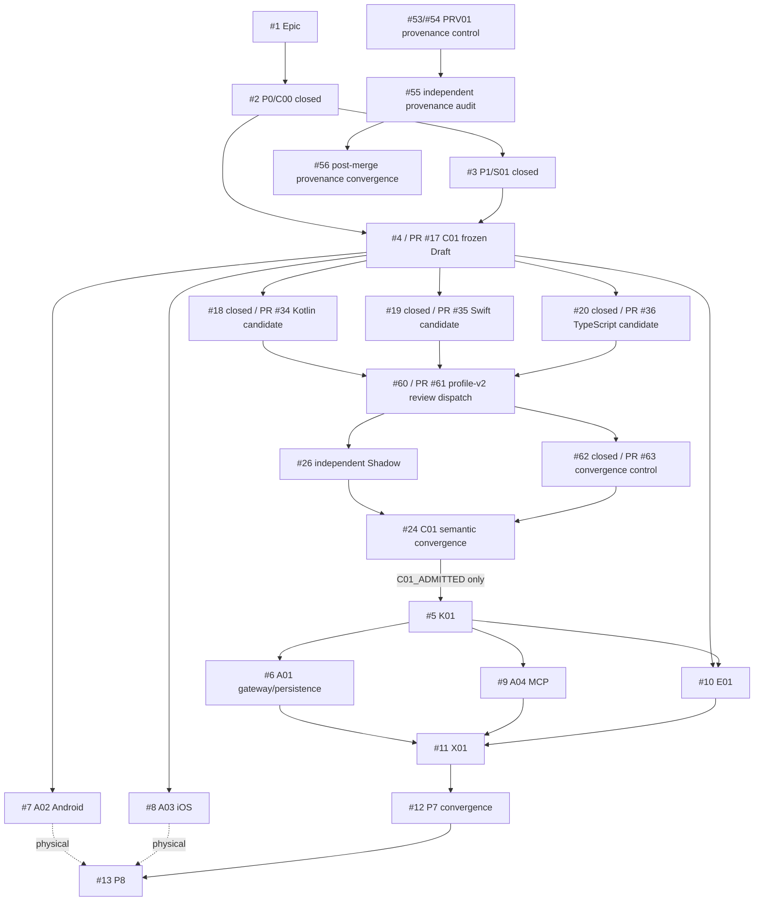

# ActionGate

Hardware-attested authorization for protected autonomous-agent actions.

> An LLM may propose an action. It is not the authorization authority.

## Exact-state law

The checked-out Git commit/tree is technical truth. A PDF, article, private document, Issue title, branch name, Draft PR, prompt packet, workflow-green state, or model statement is not a substitute for the evidence lane that owns a claim.

```bash
git rev-parse HEAD
git rev-parse HEAD^{tree}
```

This document is a technical projection only. Private product strategy, pricing, customers, career context, employer-boundary notes, and private source locators stay outside the public repository.

## Current checkpoint

This convergence was prepared from:

```text
main  70573aed229404772827829a1ce069a6e72184fa
tree  e31f35bf0b60977df995df6f97dde941dfe529f9
```

Highest earned technical state before this documentation checkpoint:

| Plane | Exact subject / owner | Earned state |
|---|---|---|
| P0/C00 + P1/S01 + D00 | merged PRs #14/#15/#16/#42/#44/#46 | `MERGED / CLOSED` at declared cloud/static/source ceilings |
| C01 frozen contract | PR #17 @ `b63589e5a16e82fda1a9554227f2ebbb55398c8a` | `DRAFT / NOT_ADMITTED` |
| Kotlin canonicalization | PR #34 @ `cf589a0990aaaa6422be9c649b52b44230d570f6` | `PROFILE_HARDENED / LOCAL_DETERMINISTIC_PASS`; Issue #18 closed at that ceiling |
| Swift canonicalization | PR #35 @ `039827061f54aa72e2b81365a4c904d25833f83e` | `PROFILE_HARDENED / LOCAL_DETERMINISTIC_PASS`; Issue #19 closed at that ceiling |
| TypeScript canonicalization | PR #36 @ `3ed9f0307df0937028bbf52fe8fbd2a6621acafe` | `PROFILE_HARDENED / LOCAL_DETERMINISTIC_PASS`; Issue #20 closed at that ceiling |
| common C01 process evidence | historical PR #38 @ `9f41038240837ea2dd9dcdb9befd13e6ba81a78e` | `HISTORICAL_PROCESS_EVIDENCE`; PR closed unmerged |
| historical launch packet | PR #41 @ `98c9545c0dd2bbfdabdaf27c8a992822a78b3840` | `HISTORICAL_LAUNCH_PREPARATION`; PR closed unmerged |
| profile-v2 independent-review dispatch | PR #61 @ `2998b0a93d23ddfca0934250d82bdbd892f2c84b` | `HOSTED_GREEN / EXTERNAL_REVIEW_PENDING` |
| fail-closed C01 convergence control | PR #63 @ `e4196305284b4751286b01f5d1d33e82fc34af0b` | `HOSTED_GREEN / BLOCKED_BY_INDEPENDENT_RECEIPT` |
| independent C01 Shadow | Issue #26 | `NOT_EXERCISED` |
| C01 admission | Issue #24 | `BLOCKED_BY_#26`; `C01_ADMITTED` absent |
| PRV01 provenance/clean-room control | PR #54 @ `d9716d029578608b6179c56def6f7ea8c3728146` | `HOSTED_DETERMINISTIC_STATIC_CONTROL_READY_FOR_INDEPENDENT_REVIEW` |
| independent provenance audit | Issue #55 | `NOT_EXERCISED` |
| P3-P6 product mechanisms | #5-#11 | `NOT_IMPLEMENTED` |
| physical Android/iOS | #7/#8/#13 | `NOT_EXERCISED` |
| legal/security/release/production | Human / independent lanes | `HUMAN_ADMIT_REQUIRED` or `NOT_PERFORMED` |

A local-deterministic C01 Worker PASS is not a hardware, MCP, independent-security, legal, user, paid, release, or production PASS.

## Security invariant

An `R3` protected tool must not execute through the compliant path without a fresh, audience-bound, exact-action-bound authorization proof accepted under the current policy version.

The planner is assumed compromisable. Enforcement belongs at the protected-tool boundary.

## Repository State Machine

```text
P0 AUTHORITY_BOUND               MERGED / CLOSED
  -> P1 SOURCE_ADMITTED          MERGED / CLOSED
  -> P2 CONTRACTS_BOUND          IN PROGRESS
       C01 contract frozen
       3 language candidates locally verified and profile-hardened
       profile-v2 external-review dispatch hosted-green
       convergence control hosted-green
       independent review #26 still missing
  -> P3 CORE_IMPLEMENTED         BLOCKED_BY_C01_ADMISSION
  -> P4 ADAPTERS_IMPLEMENTED     NOT_IMPLEMENTED
  -> P5 EVIDENCE_VERIFIED        NOT_IMPLEMENTED
  -> P6 E2E_VERIFIED             NOT_IMPLEMENTED
  -> P7 CONVERGED_AND_HANDED_OFF PARTIAL CHECKPOINTS ONLY
  -> P8 LIVE_OR_HUMAN_ADMITTED   NOT_EXERCISED / HUMAN_ADMIT_REQUIRED
```

Continuous Shadow lane:

```text
READ_ONLY_RECON
-> DELTA_CLASSIFIED
-> PRE_SIDE_EFFECT_GATE
-> ACTION_OBSERVED
-> EVIDENCE_RECONCILED
-> VERIFIED | BLOCKED | FAILED | WAIVED_WITH_AUTHORIZED_REASON
```

`SAME_CONTEXT_READ_ONLY_SHADOW` never satisfies an independent-review requirement.

## Current DAG



The Kotlin, Swift, and TypeScript branches are path-disjoint siblings. Review-only Shadow is never a Git parent. PR #61 is a superseding dispatch epoch; PR #63 is its true child because it consumes the profile-v2 dispatch contract.

## Directory ownership, State Machine, DAG role, and data flow

| Path | Owner / atom | State-machine role | Input -> output | Highest evidence |
|---|---|---|---|---|
| root `README.md`, `AGENTS.md`, `docs/traceability/**` | D convergence | repository navigation | exact GitHub readback -> current status/indexes | exact-state documentation |
| `docs/sources/**`, `.actiongate/source-claims.json`, technology ledger | S01 | source admission | article/PDF/spec/repo -> classified claim/right state | merged source disposition |
| `contracts/v1/**` | C01/#4 | contract oracle | admitted constraints -> schemas/profile/vectors/ports | frozen Draft |
| `contracts/impl/kotlin/**` | #18 / PR #34 | C01 language sibling | frozen C01 -> canonical bytes/hashes + receipt | local-deterministic PASS |
| `contracts/impl/swift/**` | #19 / PR #35 | C01 language sibling | frozen C01 -> canonical bytes/hashes + receipt | local-deterministic PASS |
| `contracts/impl/typescript/**` | #20 / PR #36 | C01 language sibling | frozen C01 -> canonical bytes/hashes + receipt | local-deterministic PASS |
| `.actiongate/c01-execution/**`, `contracts/evidence/**` | #37 / historical PR #38 | process/evidence support | frozen blobs -> schema/receipt/runtime contracts | historical exact evidence |
| `.actiongate/c01-launch/**` | #39 / historical PR #41 | launch preparation | prior control plane -> zero-context packets | historical exact evidence |
| `.actiongate/c01-shadow-dispatch/profile-v2/**` | #60 / PR #61 | external review dispatch | current Worker subjects -> 33-falsifier packet | hosted-green dispatch |
| `.actiongate/c01-convergence/profile-v2/**` | #62 / PR #63 | fail-closed convergence control | independent receipt -> candidate #24 decision | hosted-green; receipt absent |
| `.provenance/**`, `docs/provenance/**`, `sbom/**` on PR #54 | PRV01/#53 | provenance control plane | public-source relation facts -> fail-closed provenance evidence | Draft hosted deterministic |
| `packages/core-domain/**`, `packages/policy/**` | K01/#5 | deterministic domain core | `C01_ADMITTED` -> risk/challenge/grant/replay/audit | not implemented |
| `packages/gateway/**`, `packages/verifier/**` | A01/#6 | distributed trust plane | C01/K01 -> persistence/idempotency/outbox/reconciliation | not implemented |
| `packages/sdk-android/**` | A02/#7 | Android proof adapter | challenge -> hardware/user-presence/integrity proof | not implemented; physical separate |
| `packages/sdk-ios/**` | A03/#8 | iOS proof adapter | challenge -> Secure Enclave/auth/App Attest proof | not implemented; physical separate |
| `packages/mcp-middleware-*` | A04/#9 | protected-tool boundary | grant -> MCP tool enforcement | not implemented |
| `tests/**`, `packages/testkit/**` | E01/#10 | adversarial evidence | candidates -> mutation/fault/concurrency receipts | not implemented |
| `examples/devops-agent/**` | X01/#11 | narrow E2E canary | admitted C/K/A/E -> protected action receipt | not implemented |
| devices / independent reviewers / legal / Human | H01/#13 | external admission | immutable candidate -> own-lane receipts | not exercised / Human-owned |

### Runtime product data flow

```text
Planner proposal
-> canonical ActionEnvelope
-> deterministic risk policy
-> challenge
-> mobile user-presence hardware signature + app/device integrity evidence
-> authoritative verification
-> single-use ExecutionGrant
-> idempotent protected side effect
-> durable audit/outbox receipt
```

Gateway processes may scale statelessly, but device/key registration, policy versions, challenge/nonces, consumed grants, idempotency, reconciliation, and durable audit state are authoritative persisted state.

## Real-problem closure

The detailed matrix is [`docs/traceability/PROBLEM_CLOSURE_MATRIX.md`](docs/traceability/PROBLEM_CLOSURE_MATRIX.md).

Closed at an earned technical lane:

- unsupported universal `llama.cpp + GGUF + KMP` / benchmark / productivity / scarcity / blue-ocean claims are rejected or excluded;
- fully stateless trust-plane, emulator-as-physical, private-key-in-portable-native-memory, and permissive-license-as-legal-clearance substitutions are rejected;
- the C01 canonicalization profile and frozen positive hashes are reproduced in Kotlin, Swift, and TypeScript at the local-deterministic lane;
- exact digest-domain allowlists, raw ASCII-key profile, raw integer/safe-range profile, duplicate-key/Unicode/container hazards, and evidence-staleness/dispatch binding have dedicated controls;
- PRV01 now has a fail-closed public provenance-control candidate, but independent provenance admission remains open.

Still open:

```text
Issue #26 independent C01 review
Issue #24 C01 semantic admission
K01 risk/challenge/grant/replay/idempotency/audit core
A01 authoritative persistence/outbox/reconciliation
A02 Android hardware + Play Integrity
A03 iOS Secure Enclave + App Attest
A04 protected MCP tool enforcement
E01 mutation/concurrency/fault/observability evidence
X01 prompt-injected-planner E2E canary
real Android/iPhone device receipts
independent security/provenance review
upstream/dependency admission and exact release SBOM
employment/IP/legal admission
user value and paid demand
merge/release/production
```

## Molecular Stack index

Full index: [`docs/traceability/MOLECULAR_STACK_INDEX.md`](docs/traceability/MOLECULAR_STACK_INDEX.md).

### Integrated on main

| Atom | Issue | PR | Merge receipt |
|---|---:|---:|---|
| C00 | #2 | #14 | `fee8c290061542bfb93e27ddcc33cce7fbf8c653` |
| S01 | #3 | #15 | `8810fe41f66ad1b4fe80db5f93bf9539e2a38899` |
| D00 | #2 | #16 | `76efa9297d147712bb9dfbb9e797d69ca9432a99` |
| D00-MAIN | #40 | #42 | `71796b8c4d50fdfbcade85f9bbdf4d3ec988ba99` |
| D00-DELTA | #43 | #44 | `53f1014e4c75a0083c8ebe2972e8f52f3ff33b9d` |
| D00-FINALIZE | #45 | #46 | `70573aed229404772827829a1ce069a6e72184fa` |

### Current / retained molecular subjects

| Atom | Issue | PR | Head | Relation / disposition |
|---|---:|---:|---|---|
| C01 | #4 | #17 | `b63589e5a16e82fda1a9554227f2ebbb55398c8a` | frozen contract; KEEP DRAFT |
| C01-K | #18 closed | #34 | `cf589a0990aaaa6422be9c649b52b44230d570f6` | sibling candidate; KEEP DRAFT |
| C01-S | #19 closed | #35 | `039827061f54aa72e2b81365a4c904d25833f83e` | sibling candidate; KEEP DRAFT |
| C01-T | #20 closed | #36 | `3ed9f0307df0937028bbf52fe8fbd2a6621acafe` | sibling candidate; KEEP DRAFT |
| C01-EXEC | #37 closed | #38 closed | `9f41038240837ea2dd9dcdb9befd13e6ba81a78e` | `HISTORICAL_PROCESS_EVIDENCE`, unmerged |
| C01-LAUNCH | #39 closed | #41 closed | `98c9545c0dd2bbfdabdaf27c8a992822a78b3840` | `HISTORICAL_LAUNCH_PREPARATION`, unmerged |
| C01-SHADOW-v1 | #58 | #59 closed | `ce57d5db1e71223f18d1095024297391a36611f3` | historical stale profile |
| C01-SHADOW-v2 | #60 closed | #61 | `2998b0a93d23ddfca0934250d82bdbd892f2c84b` | true-child superseding dispatch; KEEP DRAFT |
| C01-CONVERGENCE-CONTROL | #62 closed | #63 | `e4196305284b4751286b01f5d1d33e82fc34af0b` | true child of #61; KEEP DRAFT |
| PRV01 | #53 | #54 | `d9716d029578608b6179c56def6f7ea8c3728146` | parallel provenance-control track; KEEP DRAFT pending #55 |

Only Issue #24 can emit `C01_ADMITTED | HOLD | REJECT`.

## Local Handoff

Machine queue: [`.actiongate/local-handoff-queue.json`](.actiongate/local-handoff-queue.json)  
Readable projection: [`docs/handoff/LOCAL_HANDOFF_EXECUTION_QUEUE.md`](docs/handoff/LOCAL_HANDOFF_EXECUTION_QUEUE.md)

`LH-MAIN-001` is the only ACTIVE item. On a trusted personal clean host it resolves the then-current `origin/main`, binds SHA/tree, verifies stable integration ancestors including this checkpoint's pre-merge base, parses machine contracts, and reads the current PR topology. It performs no reset, rebase, sync, push, merge, dependency installation, or semantic conflict resolution.

After a valid receipt, the controller may activate exactly one eligible next candidate. Current important candidates are:

- `LH-STACK-002`: observe Git Town / branch ancestry only;
- `C01-EXT-SHADOW-003`: execute Issue #26 with a genuinely separate read-only reviewer using PR #61 and the fixed 33-falsifier denominator;
- `PRV01-EXT-SHADOW-004`: execute Issue #55 against PR #54;
- later Android/iOS/security/Human lanes when their own entry conditions exist.

Queue scheduling does not create Git ancestry or semantic dependency between independent evidence lanes.

## Non-claims

ActionGate does not yet claim C01 admission, K01/core behavior, distributed replay/idempotency guarantees, MCP enforcement, Android/iOS hardware behavior, physical-device proof, independent security/provenance admission, employer-IP/legal clearance, user value, paid demand, release, or production readiness.
