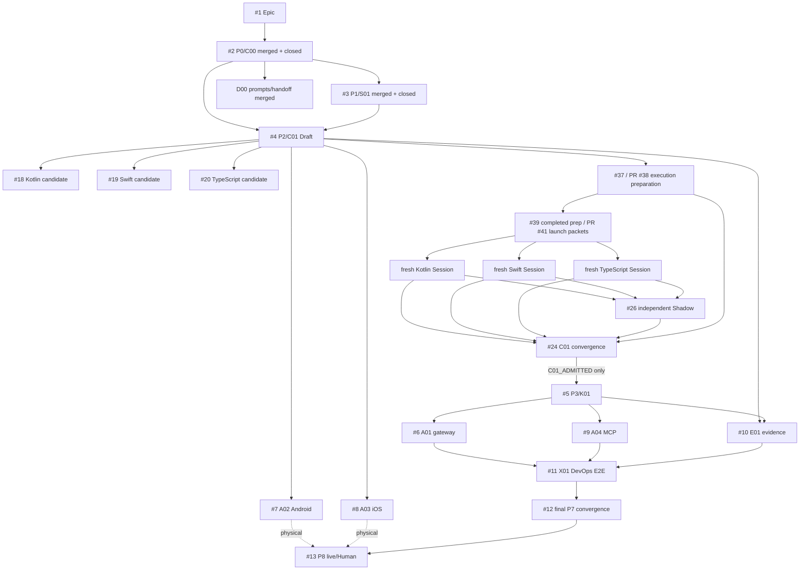
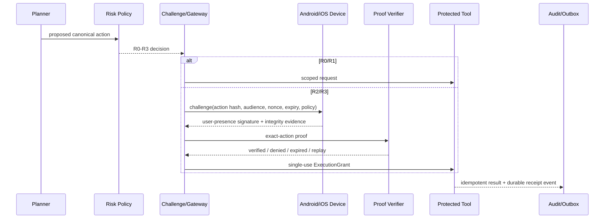

# ActionGate

Hardware-attested authorization for protected autonomous-agent actions.

> An LLM may propose an action. It does not receive unconditional authority to execute it.

## Repository status

| Field | Highest earned state |
|---|---|
| `P0 / C00` authority and technical routing | `MERGED` on main at the `cloud/static` evidence ceiling |
| `P1 / S01` source, claim, rights and dependency-candidate admission | `MERGED` on main at the `cloud/static + primary-source read-back` ceiling |
| `D00` prompts and Local Handoff contract | `MERGED` on main; queue execution remains `NOT_EXERCISED` |
| `P2 / C01` canonical contracts | `DRAFT_PREPARATION`; launch packets are Draft-published, but no Worker Session has launched and C01 is not admitted |
| Product implementation | `NOT_IMPLEMENTED` |
| Physical Android/iOS evidence | `NOT_EXERCISED` |
| Independent security/Shadow evidence | `NOT_EXERCISED` |
| User value / payment | `NOT_EXERCISED` |
| Legal, release and production admission | `HUMAN_ADMIT_REQUIRED` |
| License | Apache-2.0 |

Integrated bootstrap merge receipts:

| Atom | PR | Merge commit | Earned ceiling |
|---|---:|---|---|
| `C00` | [#14](https://github.com/ed3c/ActionGate/pull/14) | [`fee8c290`](https://github.com/ed3c/ActionGate/commit/fee8c290061542bfb93e27ddcc33cce7fbf8c653) | technical control plane / cloud-static |
| `S01` | [#15](https://github.com/ed3c/ActionGate/pull/15) | [`8810fe41`](https://github.com/ed3c/ActionGate/commit/8810fe41f66ad1b4fe80db5f93bf9539e2a38899) | source and rights disposition / cloud-static |
| `D00` | [#16](https://github.com/ed3c/ActionGate/pull/16) | [`76efa929`](https://github.com/ed3c/ActionGate/commit/76efa9297d147712bb9dfbb9e797d69ca9432a99) | prompt and handoff contract / cloud-static |
| `D00-MAIN` | [#42](https://github.com/ed3c/ActionGate/pull/42) | [`71796b8c`](https://github.com/ed3c/ActionGate/commit/71796b8c4d50fdfbcade85f9bbdf4d3ec988ba99) | exact-main documentation reconciliation / cloud-static |

A merged documentation or contract-preparation atom is not product implementation, runtime verification, hardware proof, independent security acceptance, customer validation, release or production readiness.

## Authority model

ActionGate is the technical system of record for this project only.

| Plane | Authority |
|---|---|
| Public ActionGate repository | Technical contracts, code, Issues, branches, PRs, checks, receipts, architecture and exact implementation state |
| `ed3c/skills-shared` | Canonical reusable Tech Lead, Shadow, evidence, Git Town, productization and handoff procedures; referenced rather than copied |
| Private CodexDoc | Private intent, strategic rationale, private source locations, business material, non-public roadmap and private projections |
| Human / organization | Legal and security acceptance, merge, release, production promotion, visibility and public/private-boundary changes |

GitHub exact-subject read-back wins for technical completion. A private document or Sheet can generate a redacted technical requirement, but it cannot close a GitHub task. Public files must not contain private URLs, customer data, career material, business strategy, private roadmap or employer-confidential implementation knowledge.

## Security invariant

An `R3` protected tool must not execute through the compliant path without a fresh, audience-bound, exact-action-bound authorization proof accepted under the current policy version.

The threat model assumes the planner may be compromised. The model is not an authorization authority. Enforcement belongs at the protected-tool boundary.

## Nine-stage State Machine

```text
P0 AUTHORITY_BOUND               MERGED / cloud-static
  -> P1 SOURCE_ADMITTED          MERGED / source-disposition ceiling
  -> P2 CONTRACTS_BOUND          IN PROGRESS / Draft preparation
  -> P3 CORE_IMPLEMENTED         NOT_IMPLEMENTED
  -> P4 ADAPTERS_IMPLEMENTED     NOT_IMPLEMENTED
  -> P5 EVIDENCE_VERIFIED        NOT_IMPLEMENTED
  -> P6 E2E_VERIFIED             NOT_IMPLEMENTED
  -> P7 CONVERGED_AND_HANDED_OFF PARTIAL CHECKPOINTS ONLY
  -> P8 LIVE_OR_HUMAN_ADMITTED   NOT_EXERCISED / HUMAN_ADMIT_REQUIRED
```

Continuous read-only Shadow lane:

```text
READ_ONLY_RECON
-> DELTA_CLASSIFIED
-> PRE_SIDE_EFFECT_GATE
-> ACTION_OBSERVED
-> EVIDENCE_RECONCILED
-> VERIFIED | BLOCKED | FAILED | WAIVED_WITH_AUTHORIZED_REASON
```

`SAME_CONTEXT_READ_ONLY_SHADOW` is useful preflight evidence but does not satisfy an independent-review requirement.

## Current Issue and Session DAG



Start-readiness and completion-readiness are separate edge classes. A readable Draft contract or launch packet may release preparation work; neither satisfies a completion dependency or proves a Session exists.

## Directory → owner → State Machine → DAG → data flow

| Path | Owner / Issue | State-machine role | Consumes | Produces | Highest evidence ceiling |
|---|---|---|---|---|---|
| `docs/governance/**`, root `AGENTS.md`, `ARCHITECTURE.md` | `C00 / #2` | authority and read-route control | public/private authority contract | technical-only Agent route and Shadow laws | merged cloud/static |
| `docs/sources/**`, source/candidate JSON | `S01 / #3` | source and rights admission | article, PDF, public specs/repos | claim classes, rejected overclaims, candidate rights states | merged source disposition |
| `docs/prompts/**`, `docs/handoff/**` | `D00 / #2` | zero-context routing and local handoff | stage contracts and unresolved lanes | prompts, queue, handoff packet | merged cloud/static; execution not exercised |
| `contracts/v1/**` | `C01 / #4` | canonical contract oracle | admitted C00/S01 constraints | profile, schemas, vectors and ports | Draft preparation |
| `contracts/impl/kotlin/**` | `#18` | Kotlin canonicalization candidate | frozen C01 profile/vectors | Kotlin bytes, hashes, negative controls, receipt | preparation only; implementation not exercised |
| `contracts/impl/swift/**` | `#19` | Swift canonicalization candidate | frozen C01 profile/vectors | Swift bytes, hashes, negative controls, receipt | preparation only; implementation not exercised |
| `contracts/impl/typescript/**` | `#20` | TypeScript canonicalization candidate | frozen C01 profile/vectors | TypeScript bytes, hashes, negative controls, receipt | preparation only; implementation not exercised |
| `.actiongate/c01-execution/**`, `contracts/evidence/common/**`, `contracts/evidence/schema/**` | `#37 / PR #38` | execution-control preparation | exact C01 blobs and Worker routes | capability/schema/receipt/convergence packets | Draft preparation; runtime observations non-transferable |
| `.actiongate/c01-launch/**` | `#39 / PR #41` | clean-room Session dispatch preparation | PR #38 and exact Worker heads | zero-placeholder Worker/Shadow/convergence packets and launch queue | Draft-published; actual Sessions not launched |
| `packages/core-domain/**`, `packages/policy/**` | `K01 / #5` | deterministic authorization state | admitted C01 | risk, challenge, grant, replay and audit decisions | not implemented |
| `packages/gateway/**`, `packages/verifier/**` | `A01 / #6` | distributed trust-plane adapter | C01/K01 ports | verification, persistence, idempotency and outbox | not implemented |
| `packages/sdk-android/**` | `A02 / #7` | Android proof adapter | canonical challenge/digest | Keystore/biometric/integrity evidence | not implemented; physical separate |
| `packages/sdk-ios/**` | `A03 / #8` | iOS proof adapter | canonical challenge/digest | Secure Enclave/auth/App Attest evidence | not implemented; physical separate |
| `packages/mcp-middleware-*` | `A04 / #9` | protected-tool boundary | C01/K01 grant semantics | MCP enforcement and bypass controls | not implemented |
| `packages/testkit/**`, `tests/**` | `E01 / #10` | mutation/fault evidence | candidate C/K/A atoms | falsifiers and exact-subject receipts | not implemented |
| `examples/devops-agent/**` | `X01 / #11` | narrow E2E convergence | admitted C/K/A/E | protected DevOps action receipt | not implemented |
| aggregate README/AGENTS/trace indexes | `D01 / #12`; partial checkpoints `#40/#43` | one active convergence writer per checkpoint | GitHub exact read-back | current DAG, Stack and handoff projection | exact-head documentation only |
| physical devices / independent review / Human decisions | `H01 / #13` | external evidence | immutable candidate and policy | own-lane receipts | not exercised / Human-owned |

Terminal Workers may write only their atom-local lease. They do not update aggregate indexes.

## Runtime data flow



Gateway processes may scale horizontally, but device/key registration, policy versions, challenge/nonces, consumed grants, idempotency, reconciliation and durable audit state are authoritative persisted state.

## Article / PDF problem closure

The uploaded article/PDF is a source input, not implementation truth. See [`docs/traceability/PROBLEM_CLOSURE_MATRIX.md`](docs/traceability/PROBLEM_CLOSURE_MATRIX.md).

Closed only at the **source-disposition** lane:

- “`llama.cpp + GGUF + KMP` is the universal or YC-standard answer” is rejected as a universal claim; it remains an optional later adapter candidate.
- unsupported coverage, latency, tokens/sec, productivity, scarcity and “blue ocean” numbers remain unverified and are excluded from technical claims;
- “100% prompt-injection prevention,” emulator/simulator-as-physical proof, fully stateless trust state, and permissive-license-as-legal-clearance are rejected;
- authentication, authorization, hardware signing, integrity and user presence remain separate controls.

Still open:

- cross-language canonical contract parity;
- exact-action mutation resistance;
- hardware-backed signing and app/device attestation;
- replay, idempotency, persistence and unknown-commit reconciliation;
- MCP protected-tool enforcement;
- prompt-injected-planner E2E bypass resistance;
- real Android/iPhone evidence;
- independent security and clean-room/legal review;
- runtime PII/on-device-model claims, user value and paid demand.

## Molecular Stack PR index

### Merged bootstrap and reconciliation atoms

| Atom | Issue | PR | Stable merge receipt | Relation | State |
|---|---:|---:|---|---|---|
| `C00` | #2 | [#14](https://github.com/ed3c/ActionGate/pull/14) | `fee8c290061542bfb93e27ddcc33cce7fbf8c653` | top-level from original main | `MERGED / cloud-static` |
| `S01` | #3 | [#15](https://github.com/ed3c/ActionGate/pull/15) | `8810fe41f66ad1b4fe80db5f93bf9539e2a38899` | consumed C00; sibling to D00 | `MERGED / source-disposition` |
| `D00` | #2 | [#16](https://github.com/ed3c/ActionGate/pull/16) | `76efa9297d147712bb9dfbb9e797d69ca9432a99` | consumed C00; sibling to S01 | `MERGED / queue contract` |
| `D00-MAIN` | #40 | [#42](https://github.com/ed3c/ActionGate/pull/42) | `71796b8c4d50fdfbcade85f9bbdf4d3ec988ba99` | partial exact-main convergence | `MERGED / cloud-static` |

### Active P2 preparation graph

| Atom | Issue | Branch / PR | Exact observed head | Relation | State |
|---|---:|---|---|---|---|
| `C01` | #4 | `ag/C01-action-contracts` / [#17](https://github.com/ed3c/ActionGate/pull/17) | `b63589e5a16e82fda1a9554227f2ebbb55398c8a` | contract child of S01 constraints | `DRAFT_PREPARATION` |
| `C01-Kotlin` | #18 | `ag/C01-kotlin-vectors` / [#34](https://github.com/ed3c/ActionGate/pull/34) | `0136936e7d63ba0c538d2cb40db60409107ababc` | path-disjoint sibling after C01 freeze | `PREPARATION_ONLY` |
| `C01-Swift` | #19 | `ag/C01-swift-vectors` / [#35](https://github.com/ed3c/ActionGate/pull/35) | `76b10b5a05898410ed361761626b381158edb306` | path-disjoint sibling after C01 freeze | `PREPARATION_ONLY` |
| `C01-TypeScript` | #20 | `ag/C01-typescript-vectors` / [#36](https://github.com/ed3c/ActionGate/pull/36) | `c62e24ffa0ceb2224fe6931929bfaeeceabe3c39` | path-disjoint sibling after C01 freeze | `PREPARATION_ONLY` |
| `C01 execution preflight` | #37 | `ag/C01-execution-preflight` / [#38](https://github.com/ed3c/ActionGate/pull/38) | `9f41038240837ea2dd9dcdb9befd13e6ba81a78e` | true child of C01; process/evidence sibling of language branches | `DRAFT_PREPARATION` |
| `C01 launch packets` | #39 | `ag/C01-worker-launch-packets` / [#41](https://github.com/ed3c/ActionGate/pull/41) | `98c9545c0dd2bbfdabdaf27c8a992822a78b3840` | true child of PR #38; routing sibling of language implementations | `DRAFT_PUBLISHED / NOT_LAUNCHED` |
| `C01 independent Shadow` | #26 | read-only / no PR | absent | independent evidence, never a Git parent | `NOT_EXERCISED` |
| `C01 convergence` | #24 | one semantic owner | absent | consumes exact Worker/schema/Shadow receipts | `BLOCKED_BY_WORKERS` |
| `D00 state delta` | #43 | `docs/43-pr41-state-delta` / PR pending | authoritative in the eventual PR | consumes current main + PR #41 state; not a C01 parent | `IN_PROGRESS` |

PR #17, #34, #35, #36, #38 and #41 stay Draft/open. Only Issue #24 may emit `C01_ADMITTED`; Draft publication or mergeability is not a substitute.

## Local Handoff

The machine queue is [`.actiongate/local-handoff-queue.json`](.actiongate/local-handoff-queue.json); the readable projection is [`docs/handoff/LOCAL_HANDOFF_EXECUTION_QUEUE.md`](docs/handoff/LOCAL_HANDOFF_EXECUTION_QUEUE.md).

The active local item resolves the then-current `origin/main`, binds its exact SHA/tree into a durable receipt, proves that the bootstrap and first main-convergence commits are ancestors, validates the machine contracts, and checks public/private separation. It grants no reset, rebase, sync, push, semantic conflict resolution, release or production authority.

After main readback, a clean-room implementation Session can be selected only from the exact PR #41 launch registry. A Human must provide the clean-room declaration, and the target Session must re-probe its own runtime and branch/head. A launch packet or request is not a Session observation.

Later items independently cover Git Town/Stack capability, Android, iOS, independent security/clean-room review and Human admission.

## Closure loop

```text
Evidence
-> Finding
-> Candidate
-> ChangeUnit
-> Verification
-> ClosureRecord
```

A PR title, branch, generated prompt, queue definition, same-context Shadow agreement, process exit or model statement is not a ClosureRecord by itself.

## Non-claims

This repository does not currently claim:

- implemented ActionGate product mechanisms;
- launched Kotlin/Swift/TypeScript Worker Sessions;
- cross-language C01 admission;
- Android StrongBox/TEE or iOS Secure Enclave/App Attest behavior;
- MCP authorization correctness;
- enterprise security certification;
- prompt-injection prevention in general;
- customer value, paid demand or repeatable business;
- employer-IP/legal clearance;
- release or production readiness.

## License

Apache License 2.0. Third-party candidates are not admitted merely because they appear in a ledger.
