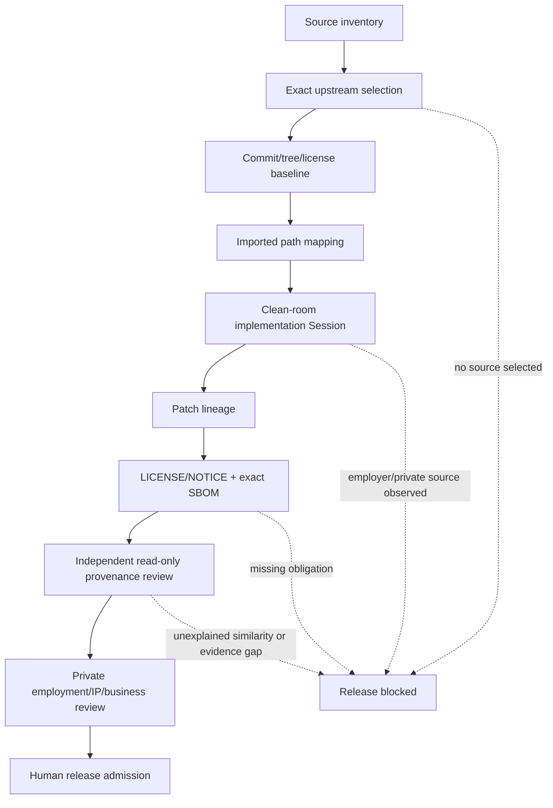

# Independent Source and Clean-Room Provenance

## Current state

```text
PROVENANCE_CONTROL_PLANE_IMPLEMENTED
UPSTREAM_SELECTION_REQUIRED
NO_IMPORTS_ADMITTED
CLEAN_ROOM_SESSION_NOT_EXERCISED
INDEPENDENT_REVIEW_NOT_EXERCISED
HUMAN_LEGAL_ADMIT_REQUIRED
RELEASE_BLOCKED
```

This control plane records where public source comes from and how independently authored patches are separated. It does not assert that any employer lacks a dependency, that the product is unrelated to an employer, or that legal ownership has been resolved.

## State Machine

```text
SOURCE_INVENTORY_BOUND
→ UPSTREAM_SELECTION_REQUIRED | UPSTREAM_IDENTIFIED
→ UPSTREAM_LICENSE_VERIFIED
→ BASELINE_SHA_TREE_PINNED
→ IMPORT_PATHS_CLASSIFIED
→ CLEAN_ROOM_ENVIRONMENT_BOUND
→ PATCH_LINEAGE_RECORDED
→ NOTICE_AND_SBOM_VERIFIED
→ INDEPENDENT_PROVENANCE_REVIEWED
→ HUMAN_LEGAL_ADMIT_REQUIRED
→ RELEASE_ELIGIBLE
```

Every transition is fail-closed. A Fork badge, repository URL, permissive license, DCO trailer, generated SBOM, or model statement satisfies only its own narrow evidence lane.

## DAG



The independent reviewer and Human legal reviewer are process/evidence dependencies, not Git parents.

## Data flow

```text
Public upstream repository
  → exact commit/tree/tag
  → LICENSE/NOTICE digest
  → upstream lock
  → source-path/target-path map
  → isolated public-input Session
  → original/derived patch records
  → notices + SPDX SBOM
  → independent review
  → redacted public receipt
  → Human release decision
```

Private employment agreements, business-overlap matrices and counsel material remain in the private intent plane. Only a redacted receipt may cross into public Git.

## Directory ownership

| Path | Owner | Input | Output | Evidence ceiling |
|---|---|---|---|---|
| `.provenance/upstreams.lock.json` | upstream baseline owner | public repository observation | exact source lock | source lineage only |
| `.provenance/imported-paths.json` | import mapper | admitted upstream lock | source-to-target mapping | path lineage only |
| `.provenance/patch-lineage.json` | patch owner | imported mapping and commits | authorship/derivation records | patch lineage only |
| `.provenance/schemas/**` | contract owner | policy | receipt/lock contracts | schema/static |
| `.provenance/receipts/**` | each evidence owner | exact subject | redacted receipt | receipt-specific |
| `docs/provenance/**` | convergence writer | machine contracts | Agent-readable rules | documentation |
| `scripts/check_provenance_control.py` | verifier owner | repository tree | deterministic verdict | local/static |
| `tests/test_provenance_control.py` | mutation owner | verifier | falsifier coverage | local/static |
| `LICENSES/**` | compliance owner | admitted upstreams | preserved licenses/notices | obligation evidence |
| `sbom/**` | SBOM owner | exact dependency/source graph | exact-subject SPDX | dependency inventory |
| private CodexDoc | Human/private owner | employment and business facts | private decision + redacted receipt | private/Human |

## Relationship modes

- `DERIVED_SOURCE`: copied or modified upstream code;
- `DEPENDENCY`: upstream consumed as a package/library;
- `REFERENCE_IMPLEMENTATION`: read for compatibility, with no copied code unless separately mapped;
- `SPECIFICATION_ONLY`: implementation derived only from a pinned public specification;
- `BUILD_TOOLING`: build/test infrastructure dependency.

Do not label a clean-room reimplementation as a Fork. Do not label copied source as specification-only.

## Current upstream decision

No product upstream has been selected. The empty registry is intentional and fail-closed. No source import is permitted until `PV-LH-001` produces an exact baseline receipt.

## Non-claims

This control plane does not establish non-infringement, employer non-use, non-overlap, patent clearance, employment ownership, legal advice, independent review, customer value, release, or production readiness.
