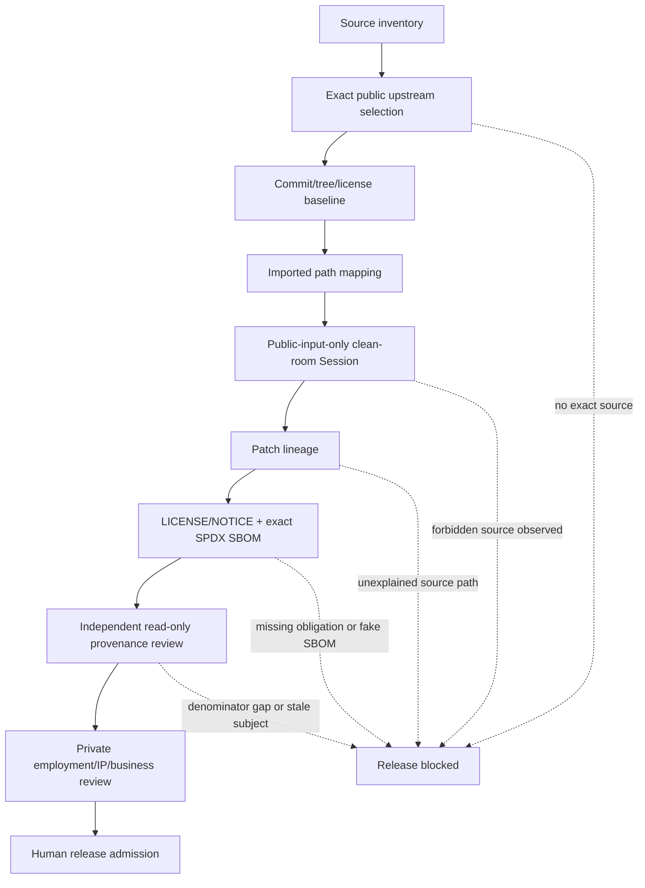

# Independent Source and Clean-Room Provenance

## Current state

```text
PROVENANCE_CONTROL_PLANE_IMPLEMENTED
HOSTED_EXACT_SUBJECT_CHECK_REQUIRED
UPSTREAM_SELECTION_REQUIRED
NO_IMPORTS_ADMITTED
CLEAN_ROOM_SESSION_NOT_EXERCISED
INDEPENDENT_REVIEW_NOT_EXERCISED
HUMAN_LEGAL_ADMIT_REQUIRED
RELEASE_BLOCKED
```

This control plane records which public source was allowed, the exact revision and license observed, how source paths entered ActionGate, which patches were original or derived, and which evidence gates remain open.

It does not assert that an employer lacks a dependency, that ActionGate is unrelated to an employer, that source similarity is absent, or that legal ownership has been resolved.

## State Machine

```text
SOURCE_INVENTORY_BOUND
→ UPSTREAM_SELECTION_REQUIRED | UPSTREAMS_ADMITTED
→ UPSTREAM_LICENSE_VERIFIED
→ BASELINE_SHA_TREE_PINNED
→ IMPORT_PATHS_CLASSIFIED
→ CLEAN_ROOM_ENVIRONMENT_BOUND
→ PATCH_LINEAGE_RECORDED
→ NOTICE_AND_SBOM_VERIFIED
→ INDEPENDENT_PROVENANCE_REVIEWED
→ HUMAN_LEGAL_ADMIT_REQUIRED
→ RELEASE_ELIGIBLE
```

Every transition fails closed. A Fork badge, public repository URL, permissive license label, DCO trailer, generated file, model statement, green workflow, or private review satisfies only its own evidence lane.

## DAG



The clean-room Builder, independent reviewer and Human legal/release authorities are separate process owners. Their receipts do not create Git ancestry by themselves.

## Data flow

```text
public repository/specification
  → exact repository + commit + tree
  → exact LICENSE/NOTICE observation and digest
  → upstream lock
  → source-path / target-path map
  → isolated public-input implementation Session
  → clean-room receipt bound to output commit/tree
  → per-target patch-lineage record
  → exact-subject LICENSE/NOTICE set and SPDX SBOM
  → independent review receipt bound to candidate/base/denominator
  → redacted outside-project review receipt
  → successor release-admission receipt
  → Human release decision
```

A receipt inside the repository cannot truthfully bind the commit that contains itself. Admission receipts therefore use the **successor-evidence pattern**:

```text
candidate commit/tree
  → read-only evidence generated
  → successor commit adds only admission metadata/receipts/SBOM/lock state
  → checker proves candidate is an ancestor and rejects unrelated successor changes
```

## Directory ownership

| Path | Owner | Input | Output | Evidence ceiling |
|---|---|---|---|---|
| `.provenance/upstreams.lock.json` | upstream baseline owner | public source observation | exact public source lock | source lineage only |
| `.provenance/imported-paths.json` | import mapper | admitted upstream | exact source/target/blob/mode mapping | path lineage only |
| `.provenance/patch-lineage.json` | patch owner | mapping + clean-room output | original/derived/spec lineage | patch lineage only |
| `.provenance/schemas/**` | contract owner | provenance laws | fail-closed receipt/lock schemas | schema/static |
| `.provenance/receipts/**` | evidence-lane owner | exact predecessor subject | redacted successor receipt | receipt-specific |
| `docs/provenance/**` | one documentation owner | machine contracts | Agent-readable route | documentation |
| `scripts/check_provenance_control.py` | verifier owner | tree + Git history | deterministic verdict | hosted/local static |
| `tests/test_provenance_control.py` | mutation owner | verifier | positive and falsifier denominator | hosted/local static |
| `LICENSES/**` | compliance owner | admitted exact upstreams | preserved license/notice texts | obligation evidence |
| `sbom/**` | SBOM owner | exact source/dependency graph | exact-candidate SPDX document | inventory only |
| private review plane | Human/private owner | employment and business facts | private decision + redacted receipt | private/Human |

## Relationship modes

- `DERIVED_SOURCE`: copied or modified upstream source;
- `DEPENDENCY`: upstream consumed as a package/library;
- `REFERENCE_IMPLEMENTATION`: read for compatibility; copying requires a separate derived mapping;
- `SPECIFICATION_ONLY`: implementation derived only from an exact public specification;
- `BUILD_TOOLING`: build/test infrastructure dependency.

Do not label a clean-room reimplementation as a Fork. Do not label copied source as `SPECIFICATION_ONLY`. Do not infer a relationship from repository reputation.

## Patch modes

```text
ORIGINAL_PATCH
DERIVED_PATCH
MECHANICAL_TRANSFORM
UNCHANGED_IMPORT
GENERATED_FROM_PUBLIC_SPEC
```

Every non-original record must match an imported-path mapping, exact upstream ID, source path, source blob and compatible relationship. Every target path must have exactly one explainable lineage.

## Commit-history controls

The verifier checks both the final tree and each changed commit in the declared base-to-head denominator:

- forbidden public locator strings cannot be hidden by adding and later deleting a file;
- every source-bearing commit is classified from that commit's own source inventory;
- required DCO trailers are checked per commit;
- base must be an ancestor of head and the denominator must be non-empty.

## Current upstream decision

No product upstream has been selected. The empty registry is intentional and fail-closed. No code import, Fork relationship or dependency admission is earned until `PV-LH-001` produces an exact baseline receipt.

## Non-claims

This control plane does not establish non-infringement, employer non-use, business non-overlap, patent/trademark/export clearance, legal advice, clean-room product execution, independent review, exact release SBOM, customer value, merge, release or production readiness.
