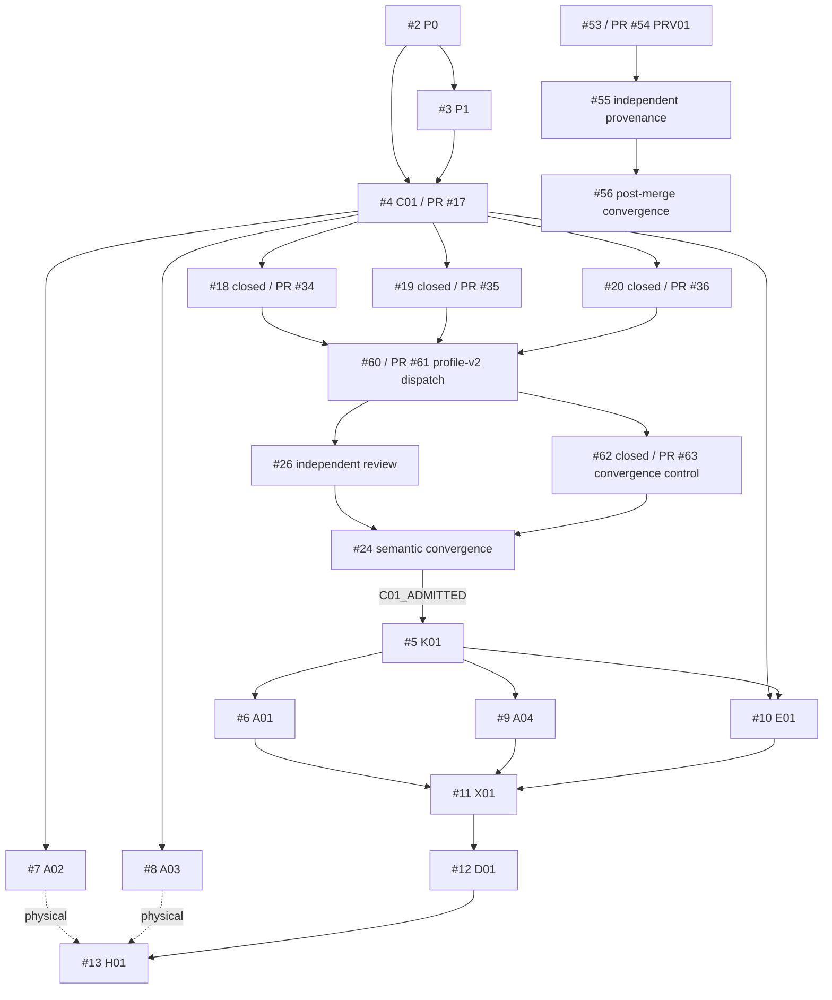

# Issue DAG

## Edge classes

- `SIBLING`: independent/path-disjoint implementation atom.
- `TRUE_CHILD`: consumes unmerged parent bytes/contracts.
- `CONVERGENCE`: single semantic/aggregate owner.
- `PROCESS_DEPENDENCY`: workflow/runtime/receipt sequencing, no Git ancestry implied.
- `EXTERNAL_EVIDENCE`: independent reviewer, physical device, legal/Human lane.
- `HISTORICAL`: completed/superseded exact subject retained for provenance.

Start-readiness and completion-readiness are separate. Chronology does not create dependency.

## Stage nodes

| Node | Issue | Atom | State |
|---|---:|---|---|
| N00 | #1 | Epic | OPEN |
| N01 | #2 | C00 | MERGED / CLOSED |
| N02 | #3 | S01 | MERGED / CLOSED |
| N02D | #2 | D00 | MERGED; local queue not yet executed |
| N03 | #4 | C01 | OPEN / NOT_ADMITTED |
| N04 | #5 | K01 | BLOCKED_BY_C01_ADMISSION |
| N05 | #6 | A01 | NOT_IMPLEMENTED |
| N06 | #7 | A02 | NOT_IMPLEMENTED |
| N07 | #8 | A03 | NOT_IMPLEMENTED |
| N08 | #9 | A04 | NOT_IMPLEMENTED |
| N09 | #10 | E01 | NOT_IMPLEMENTED |
| N10 | #11 | X01 | NOT_IMPLEMENTED |
| N11 | #12 | final D01 | OPEN / BLOCKED |
| N12 | #13 | H01 | NOT_EXERCISED |
| N64 | #64 | current-state D checkpoint | IN_PROGRESS / documentation-only until merged |

## C01 subgraph

| Node | Issue/PR | Relation | Exact/current state |
|---|---|---|---|
| C01 | #4 / #17 | contract/convergence root | `b63589e5a16e82fda1a9554227f2ebbb55398c8a` / Draft / not admitted |
| C01-K | #18 / #34 | `SIBLING` | issue CLOSED local-deterministic; PR head `cf589a0990aaaa6422be9c649b52b44230d570f6` Draft |
| C01-S | #19 / #35 | `SIBLING` | issue CLOSED local-deterministic; PR head `039827061f54aa72e2b81365a4c904d25833f83e` Draft |
| C01-T | #20 / #36 | `SIBLING` | issue CLOSED local-deterministic; PR head `3ed9f0307df0937028bbf52fe8fbd2a6621acafe` Draft |
| C01-EXEC-H | #37 / #38 | `HISTORICAL` process evidence | PR closed unmerged @ `9f41038240837ea2dd9dcdb9befd13e6ba81a78e` |
| C01-LAUNCH-H | #39 / #41 | `HISTORICAL` launch preparation | PR closed unmerged @ `98c9545c0dd2bbfdabdaf27c8a992822a78b3840` |
| C01-SH-v1 | #58 / #59 | `HISTORICAL` stale review epoch | PR closed unmerged @ `ce57d5db1e71223f18d1095024297391a36611f3` |
| C01-SH-v2 | #60 / #61 | `TRUE_CHILD` superseding review dispatch | issue closed; PR `2998b0a93d23ddfca0934250d82bdbd892f2c84b` Draft / hosted-green |
| C01-SH | #26 | `EXTERNAL_EVIDENCE` | NOT_EXERCISED |
| C01-CV-CTRL | #62 / #63 | `TRUE_CHILD` of PR #61 | issue closed; PR `e4196305284b4751286b01f5d1d33e82fc34af0b` Draft / hosted-green / blocked by independent receipt |
| C01-CV | #24 | `CONVERGENCE` | BLOCKED_BY_#26 |
| K01-PREP | #25 / #28 | `PROCESS_DEPENDENCY` after admission | BLOCKED_BY_C01_ADMISSION |

## Provenance subgraph

| Node | Issue/PR | Relation | State |
|---|---|---|---|
| PRV01 | #53 / #54 | parallel governance candidate | PR `d9716d029578608b6179c56def6f7ea8c3728146` Draft / hosted deterministic |
| PRV01-SH | #55 | `EXTERNAL_EVIDENCE` | NOT_EXERCISED |
| PRV01-CV | #56 | `CONVERGENCE` after independent admission + Human merge | BLOCKED |
| PV02 | #51 | upstream/dependency selection | OPEN / NOT_ADMITTED |

## Current DAG



## Completion law

C01:

```text
closed local-deterministic Worker leaves (#18/#19/#20)
+ exact profile-v2 dispatch (#60/#61)
+ valid external Issue #26 receipt with full 33-control denominator
+ fail-closed convergence controller (#62/#63)
-> Issue #24
-> C01_ADMITTED | HOLD | REJECT
```

Only `C01_ADMITTED` may make K01 preparation eligible.

PRV01:

```text
PR #54 exact static-control candidate
+ Issue #55 independent admission
+ explicit Human merge decision
+ actual PR #54 merge and main readback
-> Issue #56
```

## Non-substitution laws

```text
closed leaf Issue != merged PR
closed unmerged preparation PR != main integration
local-deterministic Worker PASS != independent review
hosted dispatch/checker PASS != Issue #26 verdict
fail-closed convergence controller PASS != C01_ADMITTED
same-context Shadow != independent Shadow
schema shape != signature/auth/replay correctness
source/provenance control != employer/legal clearance
physical device != simulator/emulator
technical readiness != user value/payment
```

## Convergence owners

- #24: C01 semantic admission.
- #56: PRV01 post-merge provenance navigation.
- #12: final repository/release-candidate convergence.
- #64: documentation-only current-state checkpoint; cannot supersede the semantic owners above.
